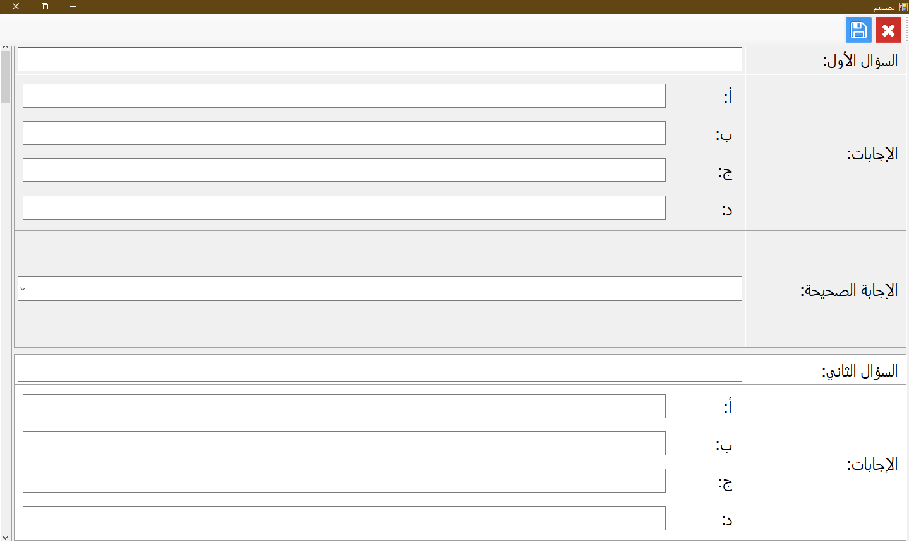

# Who Will Win Million

This program was created using Visual Basic.Net and Visual Studio 2015.

The idea of the program is simple and relies on the interface of the "Who Wants to Be a Millionaire" program and the voice of George Qirdahi.

The program is used for creating questions, quizzes, and exams, such as a top students' exam or a competition among classmates.

Click "Start" to begin the competition.

Click "New Design" to create new questions.

Click "About" to learn more about the program.

Click "Exit" to exit the program.

## Competition

When starting a new competition, the following form appears:

- The question is displayed
- The four possible answers are displayed
- You can ask the audience for help
- You can ask a random friend for help
- You can eliminate two wrong answers

# New Design

When clicking on "New Design", the following form appears:

- Write the question title with the possible answers and then choose the correct answer
- Use save icon to save the questions. An error message appears if any field is left empty.
- Click X icon to exit without saving.
